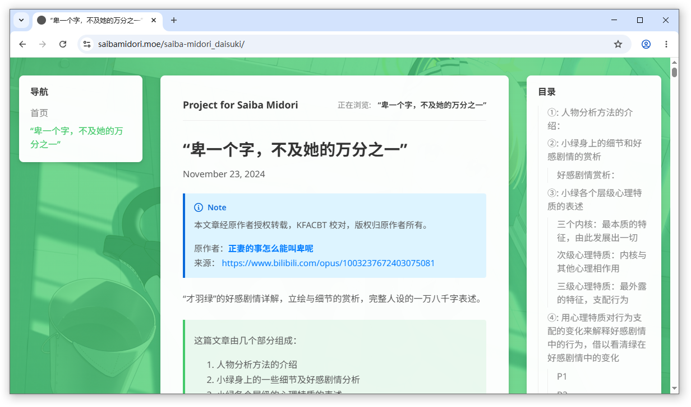

# Midori

Midori 是一个简洁的 Hugo 主题，提供左侧导航栏、可选目录卡片、移动端 App Bar 与抽屉式导航、多语言界面文案，以及偏阅读体验的页面布局。

[English README](README.md) | [查看演示](https://saibamidori.moe/)



## 特性

- 桌面端三栏布局：导航、正文、目录
- 移动端 App Bar 与抽屉式侧边导航
- 仅在页面存在真实标题链接时显示 TOC
- 返回顶部按钮
- 内置 Hugo i18n 界面文案
- 仅在当前页面存在对应翻译版本时显示语言切换器
- 首页可选文章/页面列表模式

## 要求

- Hugo `>= 0.146.0`

## 安装

将主题作为子模块添加到站点：

```powershell
git submodule add https://github.com/Saiba-Midori-Projects/gohugo-theme-midori.git themes/midori
```

然后在站点配置中启用主题：

```toml
theme = "midori"
```

如果你把主题克隆到其他目录名，`theme` 的值也要与目录名保持一致。

## 快速开始

下面是一份与当前主题功能匹配的示例配置：

```toml
baseURL = "https://example.org/"
defaultContentLanguage = "zh-CN"
defaultContentLanguageInSubdir = false
theme = "midori"

[languages]
  [languages.zh-CN]
    languageCode = "zh-CN"
    languageName = "简体中文"
    title = "My Site"
    weight = 1

  [languages.en]
    languageCode = "en-US"
    languageName = "English"
    title = "My Site"
    weight = 2

[markup]
  [markup.goldmark]
    [markup.goldmark.renderer]
      unsafe = true
  [markup.tableOfContents]
    startLevel = 1
    endLevel = 3

[params]
  themeName = "Midori"
  version = "0.1.1"
  homeListPages = false
  # homeListSections = ["posts"]
```

## 自定义参数

主题目前会从 `params` 中读取这些自定义参数：

```toml
[params]
  themeName = "Midori"
  version = "0.1.1"
  favicon = "/favicon.ico"
  backgroundImage = "images/default_bg.png"
  homeListPages = false
  # homeListSections = ["posts"]

  [params.author]
    name = "Your Name"
    email = "you@example.com"
```

- `params.backgroundImage`：页面背景图，由主布局读取，适合填写 `images/bg.png` 这类相对静态资源路径。
- `params.favicon`：站点 favicon 地址；未设置时会回退到 `/favicon.ico`。
- `params.author.name`：页脚版权区域显示的作者名。
- `params.author.email`：页脚作者链接使用的邮箱地址。
- `params.themeName`：浏览器控制台主题标识中显示的主题名。
- `params.version`：浏览器控制台主题标识中显示的版本号。
- `params.homeListPages`：是否启用首页列表模式。
- `params.homeListSections`：当 `homeListPages = true` 时，用于限制首页仅列出指定 section。

## 导航栏

左侧导航栏可以用两种方式配置。

方式一：在站点配置里使用 `menus.main`

```toml
[menus]
  [[menus.main]]
    identifier = "menu.home"
    name = "首页"
    pageRef = "/"
    weight = 10

  [[menus.main]]
    identifier = "menu.about"
    name = "关于"
    pageRef = "/about"
    weight = 20
```

方式二：在页面 front matter 中声明菜单归属

```toml
+++
title = "About"
[menus]
  [menus.main]
    weight = 20
+++
```

如果菜单项设置了 `identifier`，主题会优先通过 Hugo `i18n` 尝试翻译对应名称。

## 多语言支持

主题内置界面文案通过 Hugo `i18n` 翻译，目前已提供：

- `i18n/zh-CN.toml`
- `i18n/en.toml`

语言切换器仅在以下情况下显示：

- 当前普通页面存在对应翻译版本
- 或首页确实存在对应语言的首页内容文件，例如 `content/_index.en.md`

例如：

```text
content/_index.md
content/_index.en.md
content/about.md
content/about.en.md
```

如果 `about.en.md` 不存在，那么 `/about/` 页面不会显示语言切换器。

## TOC 行为

- 只有当 Hugo 实际生成了标题链接时，才会显示 TOC
- 如果没有真实目录项，移动端 TOC 按钮也会一并隐藏
- 可以通过页面 front matter 单独关闭 TOC
- TOC 层级由 Hugo 配置控制，例如：

```toml
[markup.tableOfContents]
  startLevel = 1
  endLevel = 3
```

单页面示例：

```toml
+++
title = "首页"
toc = false
+++
```

设置 `toc = false` 后，该页面的 TOC 卡片和移动端 TOC 按钮都会一起隐藏。

## 首页列表模式

默认情况下，首页只渲染自己的正文内容。

如果你想把首页改成类似博客索引页：

```toml
[params]
  homeListPages = true
```

如果只想列出特定 section：

```toml
[params]
  homeListPages = true
  homeListSections = ["posts"]
```

## 主题开发

当前仓库将演示内容放在 `exampleSite/content` 中。

开发主题时，直接在主题仓库根目录运行：

```powershell
hugo server -D
```

根目录的 `hugo.toml` 已经把 `contentDir` 指向 `exampleSite/content`，因此日常开发时不需要再手动写较长的 `--source` 参数。

演示站点的构建产物已通过 `.gitignore` 忽略：

- `exampleSite/public/`
- `exampleSite/.hugo_build.lock`

## 目录结构

```text
assets/           CSS 与 JavaScript
exampleSite/      演示内容与演示站点配置
i18n/             界面翻译
layouts/          主题模板与 partials
static/           静态资源
```

## 许可证

[MIT](LICENSE)
